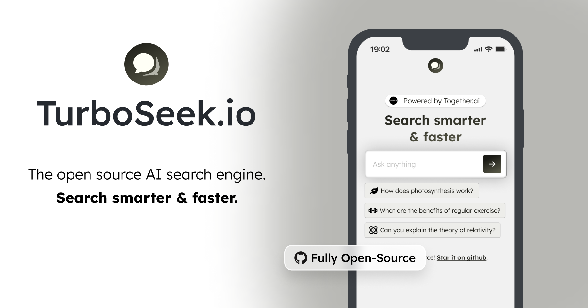
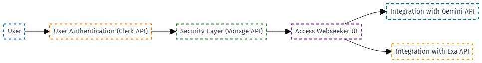

<a href="https://www.webseeker.io">
  
  <h1 align="center">WebSeeker</h1>
</a>

  An open source AI search engine. Powered by Together.ai.

## Tech stack

- Next.js app router with Tailwind
- Gemini AI for LLM inference
- Gemini Flask-2.5 for the LLMs
- Exa.ai for the search API
- Plausible for website analytics

## How it works

1. Take in a user's question
2. Make a request to the Exa AI search built API to look up the top 6 results and show them
3. Scrape text from the 6 links bing sent back and store it as context
4. Make a request to gemini flask 2.5 with the user's question + context & stream it back to the user
5. Make another request to gemini to come up with 3 related questions the user can follow up with

## Cloning & running

1. Fork or clone the repo
2. Create an account at [Gemini](https://gemini.google.com) for the LLM
3. Create an account at [Vonage](https://dashboard.nexmo.com/sign-in) for two-factor authentication
4. Create an account at [Exa AI](https://dashboard.exa.ai) for Search built
5. Create a `.env` (use the `.example.env` for reference) and replace the API keys
6. Run `npm install` and `npm run dev` to install dependencies and run locally

## Future tasks

- [ ] Move back to the Google Gemini SDK + simpler streaming
- [ ] Add a tokenizer to smartly count number of tokens for each source and ensure we're not going over
- [ ] Add a regenerate option for a user to re-generate
- [ ] Make sure the answer correctly cites all the sources in the text & number the citations in the UI
- [ ] Add sharability to allow folks to share answers
- [ ] Automatically scroll when an answer is happening, especially for mobile
- [ ] Fix hard refresh in the header and footer by migrating answers to a new page
- [ ] Add upstash redis for caching results & rate limiting users
- [ ] Add in more advanced RAG techniques like keyword search & question rephrasing

## Inspiration

- Perplexity
- You.com
- Lepton search

Submitted for DevNetwork [API + Cloud + Data] Hackathon 2025